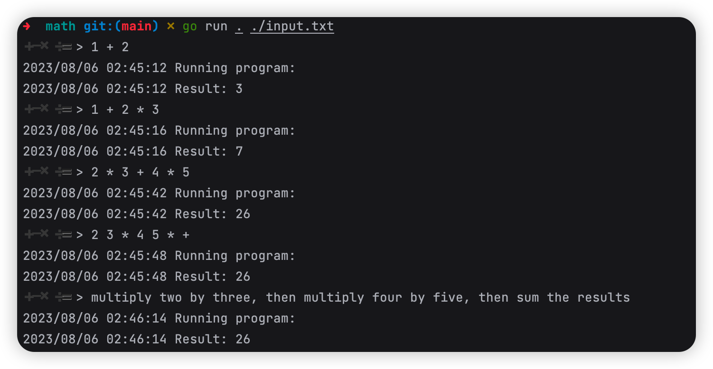

[English](./README.md) | 简体中文

<a name="readme-top"></a>

<!-- PROJECT SHIELDS -->

[![go report card][go-report-card]][go-report-card-url]
[![Go.Dev reference][go.dev-reference]][go.dev-reference-url]
[![Go package][go-pacakge]][go-pacakge-url]
[![MIT License][license-shield]][license-url]
[![Contributors][contributors-shield]][contributors-url]
[![Forks][forks-shield]][forks-url]
[![Stargazers][stars-shield]][stars-url]
[![Issues][issues-shield]][issues-url]

# TypeChat-Go

这是 [microsoft/TypeChat](https://github.com/microsoft/TypeChat) 的 Go 语言实现。

TypeChat-Go 是一个库，它通过 Schema 的方式实现 Prompt，以替代自然语言方式。

⭐️ 点个star支持我们的工作吧！

# 入门指南

安装 TypeChat-Go:

```bash 
go get github.com/maiqingqiang/typechat-go
```

配置环境变量

目前，示例可以使用 OpenAI 或 Azure OpenAI。
要使用 OpenAI，请使用以下环境变量：

| 环境变量             | 值                                     |
|------------------|---------------------------------------|
| `OPENAI_MODEL`   | OpenAI 模型名称（例如 gpt-3.5-turbo 或 gpt-4） |
| `OPENAI_API_KEY` | 你的 OpenAI 密钥                          |

要使用 Azure OpenAI，请使用以下环境变量：

| 环境变量                    | 值                                                                                                                                                                  |
|-------------------------|--------------------------------------------------------------------------------------------------------------------------------------------------------------------|
| `AZURE_OPENAI_ENDPOINT` | Azure OpenAI REST API 的完整 URL (e.g. `https://YOUR_RESOURCE_NAME.openai.azure.com/openai/deployments/YOUR_DEPLOYMENT_NAME/chat/completions?api-version=2023-05-15`) |
| `AZURE_OPENAI_API_KEY`  | 你的 Azure OpenAI 密钥                                                                                                                                                 |

# 示例

要了解 TypeChat-Go 的实际效果，请查看此[examples](./examples)目录中的示例。

每个示例展示了 TypeChat-Go 如何处理自然语言输入，并将其映射为经过验证的 JSON 输出。大多数示例输入都适用于 GPT 3.5 和 GPT 4。

| 示例名称                                                                             | 描述                                                                                                            |
|----------------------------------------------------------------------------------|---------------------------------------------------------------------------------------------------------------|
| [情感分析](https://github.com/maiqingqiang/TypeChat-Go/tree/main/examples/sentiment) | 一种情感分类器，将用户输入分类为负面、中性或积极。这是 TypeChat-Go 的 "hello world!"                                                      |
| [咖啡店](https://github.com/maiqingqiang/TypeChat-Go/tree/main/examples/coffeeShop) | TODO                                                                                                          |
| [日历](https://github.com/maiqingqiang/TypeChat-Go/tree/main/examples/calendar)    | 智能调度程序。此示例将用户意图转化为一系列的操作来修改日历。                                                                                |
| [餐厅](https://github.com/maiqingqiang/TypeChat-Go/tree/main/examples/restaurant)  | 一个用于在餐厅接受订单的智能代理。类似于咖啡店示例，但使用了更复杂的架构来建模更复杂的语言输入。散文文件说明了在处理复合句、干扰和更正时，简单和高级语言模型之间的界限。此示例还展示了如何使用 Go 定义来描述用户意图。 |
| [数学计算](https://github.com/maiqingqiang/TypeChat-Go/tree/main/examples/math)      | 将计算转化为可以执行四个基本数学运算符的 API 给定的简单程序。此示例突显了 TypeChat-Go 的程序生成能力。                                                  |
| [音乐](https://github.com/maiqingqiang/TypeChat-Go/tree/main/examples/music)       | TODO                                                                                                          |

## 运行示例

运行其中一个示例，可以在其目录下运行 `go run . <input-file-path>`。
F例如，在 [math](./examples/math) 目录中，你可以运行：

```
go run . /input.txt
```



<!-- MARKDOWN LINKS & IMAGES -->

[contributors-shield]: https://img.shields.io/github/contributors/maiqingqiang/TypeChat-Go.svg
[contributors-url]: https://github.com/maiqingqiang/TypeChat-Go/graphs/contributors
[forks-shield]: https://img.shields.io/github/forks/maiqingqiang/TypeChat-Go.svg
[forks-url]: https://github.com/maiqingqiang/TypeChat-Go/network/members
[stars-shield]: https://img.shields.io/github/stars/maiqingqiang/TypeChat-Go.svg
[stars-url]: https://github.com/maiqingqiang/TypeChat-Go/stargazers
[issues-shield]: https://img.shields.io/github/issues/maiqingqiang/TypeChat-Go.svg
[issues-url]: https://github.com/maiqingqiang/TypeChat-Go/issues
[license-shield]: https://img.shields.io/github/license/maiqingqiang/TypeChat-Go.svg
[license-url]: https://github.com/maiqingqiang/TypeChat-Go/blob/main/LICENSE
[go-report-card]: https://goreportcard.com/badge/github.com/maiqingqiang/typechat-go
[go-report-card-url]: https://goreportcard.com/report/github.com/maiqingqiang/typechat-go
[go.dev-reference]: https://img.shields.io/badge/go.dev-reference-blue?logo=go&logoColor=white
[go.dev-reference-url]: https://pkg.go.dev/github.com/maiqingqiang/typechat-go?tab=doc
[go-pacakge]: https://github.com/maiqingqiang/TypeChat-Go/actions/workflows/test.yml/badge.svg?branch=main
[go-pacakge-url]: https://github.com/maiqingqiang/TypeChat-Go/actions/workflows/test.yml